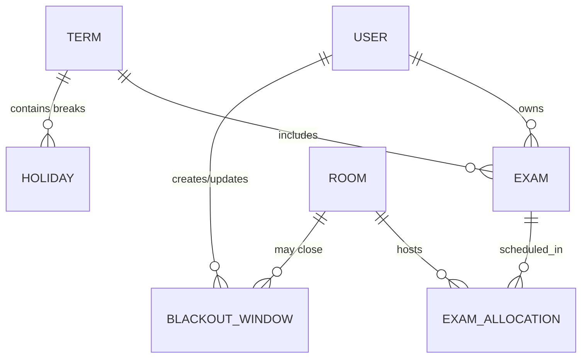

# Architecture Overview

## Runtime
- **Framework**: Django 5 with Django REST framework for API endpoints.
- **Authentication**: JWT via djangorestframework-simplejwt.
- **Schema**: drf-spectacular exposes `/api/schema/` and `/api/docs/` for API discovery.
- **Database**: PostgreSQL 16 (Docker Compose). Connections configured through `DATABASE_URL`.
- **Task/Cache (future)**: Redis service declared as an optional profile in Docker Compose.

## Project layout
```
├── Dockerfile
├── docker-compose.yml
├── Makefile
├── pyproject.toml / uv.lock
├── src/
│   ├── config/        # Django project configuration (settings, urls, wsgi/asgi)
│   ├── apps/health/   # Example app with health endpoint
│   ├── manage.py
│   ├── templates/
│   ├── static/
│   └── locale/
└── docs/
```

## Configuration
- Settings rely on environment variables loaded via `django-environ` (see `src/.env.example`).
- Default locale is `fa-IR`; timezone is `Asia/Tehran` with UTC persisted in the database.
- REST framework defaults to JWT auth and includes Django Filter backend.

## Observability & health
- `/api/health/` returns a JSON payload to support uptime checks.
- Logging, metrics, and tracing integrations will be documented in future ADRs.

## Tooling
- Dependency management with uv (Python 3.13 virtualenv in `.venv`).
- Quality gates enforced by pre-commit (ruff, black, isort, mypy) and pytest.
- Make targets wrap common workflows (`make fmt`, `make lint`, `make test`, etc.).

## Domain relationships

